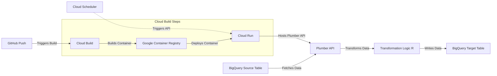

# Workflow: Delivering Physical Activity Scores to BigQuery

This workflow automatically updates a BigQuery table with physical activity scores on a scheduled basis. It leverages Google Cloud services, R, and Docker to build a fully automated pipeline.

## Components

1. **Plumber API**: An R-based API that retrieves raw data from BigQuery, transforms it, and writes updates back to BigQuery.
2. **Docker**: Containers the Plumber API for consistent deployment.
3. **Cloud Build**: Automates the container build and deployment process.
4. **Cloud Run**: Runs the containerized Plumber API as a serverless application.
5. **Cloud Scheduler**: Triggers the API on a predefined schedule.
6. **BigQuery**: Stores both the raw data and the transformed physical activity scores.

## Workflow Diagram

Below is a Mermaid diagram illustrating the pipeline workflow:

---
