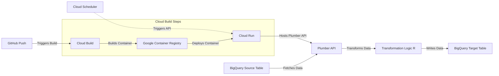

# Workflow: Delivering Physical Activity Scores to BigQuery

This workflow automatically updates a BigQuery table with physical activity scores on a scheduled basis. It leverages Google Cloud services, R, and Docker to build a fully automated pipeline.

---

## Components

1. **Plumber API**: An R-based API that retrieves raw data from BigQuery, transforms it, and writes updates back to BigQuery.
2. **Docker**: Containers the Plumber API for consistent deployment.
3. **Cloud Build**: Automates the container build and deployment process.
4. **Cloud Run**: Runs the containerized Plumber API as a serverless application.
5. **Cloud Scheduler**: Triggers the API on a predefined schedule.
6. **BigQuery**: Stores both the raw data and the transformed physical activity scores.

---

## Workflow Diagram

Below is a Mermaid diagram illustrating the pipeline workflow:



---

## Deployment Steps

### Option A: Using Google Cloud Console UI

#### Step 1: Set Up BigQuery

1. **Create Dataset and Table**:
   - Navigate to the [BigQuery Console](https://console.cloud.google.com/bigquery).
   - Click **Create Dataset**:
     - **Dataset ID**: `ReturnOfInformation`.
   - Click on the dataset and click **Create Table**:
     - **Table ID**: `physical_activity`.
     - Configure the schema as needed.

2. **Set Permissions**:
   - In the BigQuery Console, go to the dataset's **Permissions** tab.
   - Add the service account used by the API with the role **BigQuery Data Editor**.

---

#### Step 2: Deploy the API

1. **Set Up Cloud Build Trigger**:
   - Go to [Cloud Build Triggers](https://console.cloud.google.com/cloud-build/triggers).
   - Click **Create Trigger**.
   - Select your GitHub repository and specify the branch (e.g., `main`).
   - Under **Build Configuration**:
     - **Type**: Cloud Build configuration file (`cloudbuild.yaml`).
     - **Location**: `/cloudbuild.yaml`.
   - Save the trigger.
   - Push to the specified branch in GitHub to automatically build and deploy the API.

2. **Verify Cloud Run Deployment**:
   - Go to [Cloud Run](https://console.cloud.google.com/run).
   - Confirm that the service (`roi`) is deployed.
   - Click on the service name to view details, including the service URL.
   - Verify that the `PROJECT_ID` environment variable is correctly set.

---

#### Step 3: Configure Cloud Scheduler

1. **Create a Cloud Scheduler Job**:
   - Go to [Cloud Scheduler](https://console.cloud.google.com/cloudscheduler).
   - Click **Create Job**.
     - **Name**: `update-physical-activity`.
     - **Frequency**: Set the desired cron schedule (e.g., `0 9 * * *` for 9:00 AM daily).
     - **Target**: HTTP.
     - **URL**: `https://<CLOUD_RUN_URL>/update_roi_physical_activity_data` (replace `<CLOUD_RUN_URL>` with your Cloud Run service URL).

2. **Add Authentication**:
   - In the **Authentication Header** section:
     - **Type**: OIDC Token.
     - **Service Account**: Use the service account deployed with the API.

3. **Save and Test the Job**:
   - Save the job.
   - Verify that it appears in the Cloud Scheduler dashboard.
   - Manually trigger the job to test.

---

#### Step 4: Verify the Workflow

1. **Check Cloud Run Logs**:
   - Go to [Cloud Run](https://console.cloud.google.com/run).
   - View the logs to confirm the API was called and that rows were appended to BigQuery.

2. **Check BigQuery Table**:
   - Navigate to the `ReturnOfInformation.physical_activity` table in BigQuery.
   - Confirm that new rows have been added.

---

---

### Option B: Using the Command Line

#### Step 1: Set Up BigQuery

1. **Create Dataset and Table**:
   - Open the Google Cloud Console and navigate to **BigQuery**.
   - Create a new dataset:
     ```bash
     bq mk --dataset --location=US <PROJECT_ID>:ReturnOfInformation
     ```
     Replace `<PROJECT_ID>` with your Google Cloud project ID.
   - Create a table within the dataset:
     ```bash
     bq mk --table <PROJECT_ID>:ReturnOfInformation.physical_activity <SCHEMA_FILE>
     ```
     Replace `<SCHEMA_FILE>` with the path to a schema JSON file if you have one, or use the UI to define the schema.

2. **Set Permissions**:
   - Assign the service account access to the BigQuery dataset:
     ```bash
     gcloud projects add-iam-policy-binding <PROJECT_ID> \
       --member="serviceAccount:<SERVICE_ACCOUNT_EMAIL>" \
       --role="roles/bigquery.dataEditor"
     ```
     Replace `<SERVICE_ACCOUNT_EMAIL>` with the service account email used by Cloud Run.

---

#### Step 2: Deploy the API

1. **Build and Push the Container**:
   - Build the Docker container:
     ```bash
     docker build -t gcr.io/<PROJECT_ID>/roi:<TAG> .
     ```
     Replace `<PROJECT_ID>` with your project ID and `<TAG>` with a specific tag (e.g., `latest` or a commit hash).
   - Push the container to Google Container Registry:
     ```bash
     docker push gcr.io/<PROJECT_ID>/roi:<TAG>
     ```
     Ensure the `<PROJECT_ID>` matches your GCP project.

2. **Deploy to Cloud Run**:
   - Deploy the container image to Cloud Run:
     ```bash
     gcloud run deploy roi \
       --image=gcr.io/<PROJECT_ID>/roi:<TAG> \
       --region=us-central1 \
       --platform=managed \
       --allow-unauthenticated \
       --service-account=<SERVICE_ACCOUNT_EMAIL> \
       --set-env-vars=PROJECT_ID=<PROJECT_ID>
     ```
     - Replace `<PROJECT_ID>` with your GCP project ID.
     - Replace `<SERVICE_ACCOUNT_EMAIL>` with the service account email used for deployment.
     - Optionally adjust the region if necessary.

---

#### Step 3: Configure Cloud Scheduler

1. **Create Cloud Scheduler Job**:
   - Use the following command to create the job:
     ```bash
     gcloud scheduler jobs create http update-physical-activity \
       --schedule="0 9 * * *" \
       --uri="https://<CLOUD_RUN_URL>/update_roi_physical_activity_data" \
       --http-method=POST \
       --oidc-service-account-email=<SERVICE_ACCOUNT_EMAIL>
     ```
     - Replace `<CLOUD_RUN_URL>` with the URL of your deployed Cloud Run service.
     - Adjust the schedule (in cron format) as needed.
     - Replace `<SERVICE_ACCOUNT_EMAIL>` with the service account email authorized to trigger the job.

2. **Test the Job**:
   - Manually trigger the Cloud Scheduler job:
     ```bash
     gcloud scheduler jobs run update-physical-activity
     ```
   - Verify the logs in Cloud Run to confirm the API was successfully triggered.

---

#### Step 4: Verify the Workflow

1. **Check Cloud Run Logs**:
   - View the logs of the deployed service to ensure the API executed as expected:
     ```bash
     gcloud logs read --project=<PROJECT_ID> --service=roi
     ```
   - Confirm that data was processed and appended to BigQuery.

2. **Inspect BigQuery**:
   - Navigate to the BigQuery table `ReturnOfInformation.physical_activity` in the Google Cloud Console.
   - Verify that new rows were added.

---

This command-line setup provides full control over the pipeline and ensures reproducibility across environments.

---

## Files in This Repository

- **`plumber_api.R`**: Hosts the API logic, including endpoints for testing (`/heartbeat`) and updating physical activity scores (`/update_roi_physical_activity_data`).
- **`get_roi_physical_activity_scores.R`**: Implements data fetching and transformation logic. Must be in the same directory as `plumber_api.R`.
- **`Dockerfile`**: Defines the container for the API, including all necessary dependencies.
- **`cloudbuild.yaml`**: Automates building, pushing, and deploying the container to Cloud Run.

---

## Testing the Pipeline

1. **Local API Testing**:
   - Build and run the Docker container locally:
     ```bash
     docker build -t plumber-api .
     docker run -p 8000:8000 plumber-api
     ```
   - Visit `http://localhost:8000/heartbeat` to check if the API is running.

2. **Deployment Verification**:
   - Access the Cloud Run service URL.
   - Test the `/heartbeat` endpoint to confirm the service is operational.

3. **Cloud Scheduler Test**:
   - Manually trigger the Cloud Scheduler job.
   - Verify that the API is called and data is updated in BigQuery.

---

## Notes

- **Environment Variables**:
  - The `PROJECT_ID` environment variable is crucial for the API to interact with the correct GCP project.

- **Service Account Permissions**:
  - Ensure the service account has the necessary permissions for BigQuery and Cloud Run.

- **Error Handling**:
  - The API logs messages for both successful operations and errors.

---

This pipeline ensures consistent and automated delivery of physical activity scores to BigQuery, simplifying maintenance and reducing manual effort.